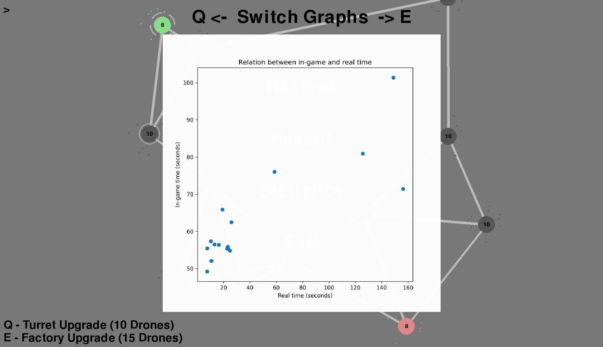
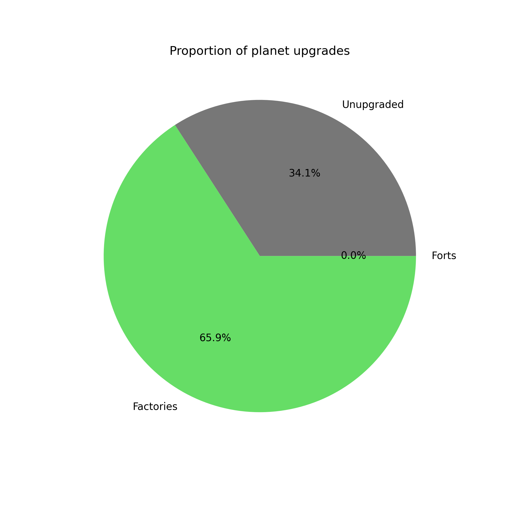
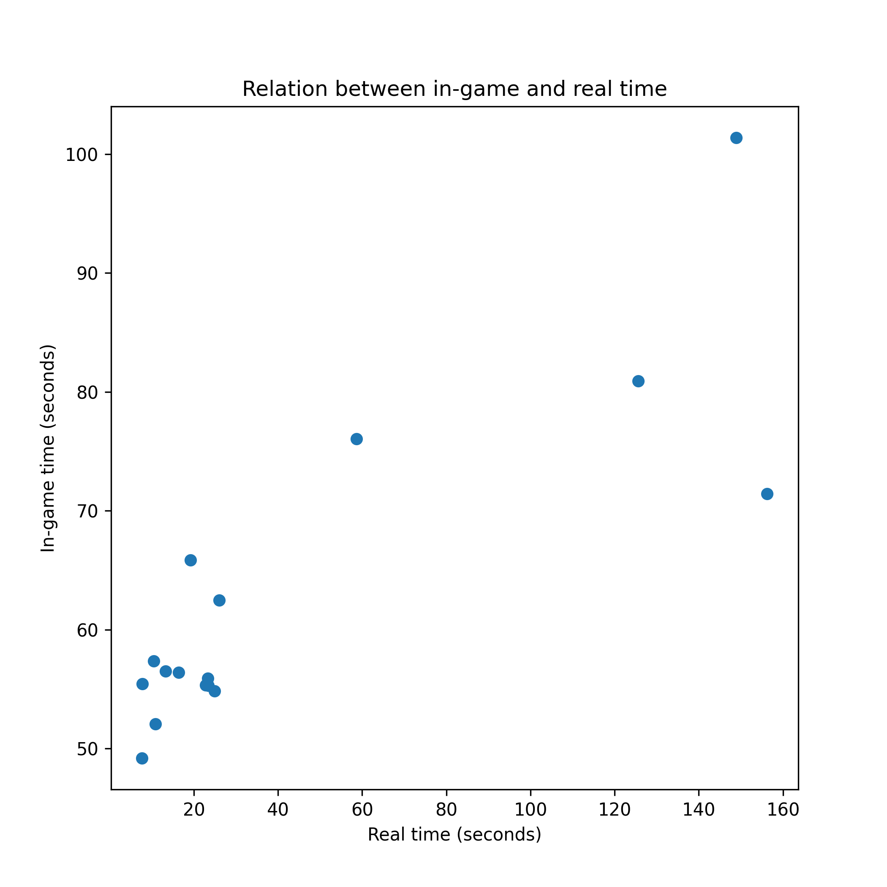
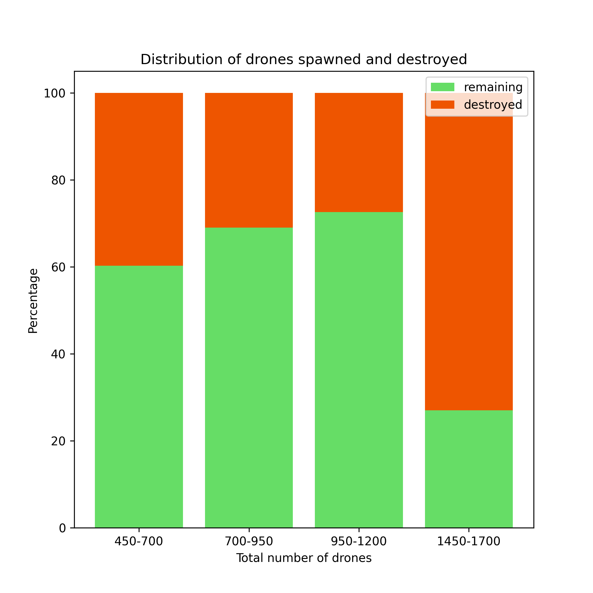

# Data visualization

### Statistics page

This is the statistics page. It can be accessed by pressing the escape key, and clicking on the statistics button. Use the keys Q/E to switch graphs and press escape to stop viewing the statistics.  
  
There are 3 graphs and 1 table:
- Proportion of planet upgrades (Pie Chart)
- Relation between in-game and real time (Scatter plot)
- Distribution of drones spawned and destroyed (Stacked bar chart)
- Table of game overall (One table split into 3 for readability)

### Proportion of planet upgrades

This is a pie chart of upgrades the user has when the game ends. Gray means planets are unupgraded, Green means the planets are upgraded to factories, and Blue means the planets are upgraded to forts. The objective is to summarize the player's behavior on planet upgrades.  
  
The chart shows that the user mainly focuses on capturing planets rather than making upgrades, since 50.8% of planets are unupgraded. Factories are also used more than forts (32.1% to 17.1%), despite the higher upgrade cost.

### Relation between in-game and real time

This is a scatter plot between recorded in-game and real times, in seconds. As a reminder, each point is a separate game, in-game time is affected by fast-forwarding and pausing while real times are not. The objective is to analyze the player's playstyle (whether they play fast or not).  
  
The chart clearly shows that in-game time and real-time are correlated, and that Real time is usually faster than in-game time (with some outliers). Overall, this means the player usually plays at a faster speed than the default, and it can also mean they pause the game less.

### Distribution of drones spawned and destroyed

This is a stacked bar chart. The Y axis is a percentage that goes from 0% to 100% and the X axis are bins of the total amount of drones created, ranging from 350 to 2600. The objective is to find out whether there is a change in the ratio of drones at larger scales.
  
The chart shows that the ratio of drones created versus destroyed does not meaningfully change the larger the scale of the game is. It is interesting, however, that it looks like the variance gets higher as the scale gets larger.  

<small>*Note for the graph: The text is a little small due to having to fit ranges in the X axis. I tried using matplotlib's histogram to put the labels between the bars but the function is not flexible enough to implement these types of graphs, so I had to use bar graphs.*</small>